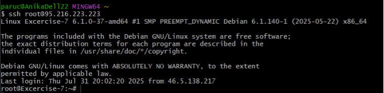
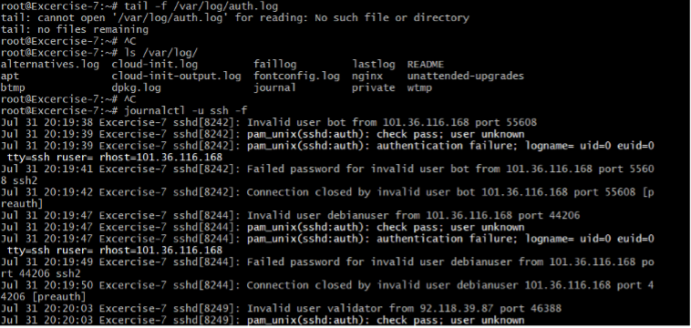
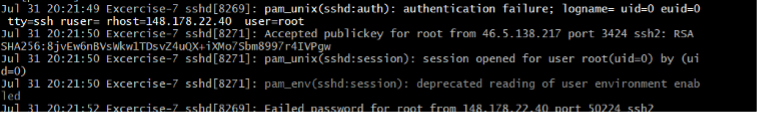

# Excersise 10: Using the tail -f Command

## Step 1: Connect to the VM



## Step 2: Check the Authentication Log

At first, I tried:

```tf
tail -f /var/log/auth.log
```

However, this file did not exist.
By running

```tf
ls /var/log/
```

I found out that the system uses journal instead.

So, to view the log in real time, I used:

```tf
journalctl -u ssh -f
```

There you can also see how many login attempts are being made — most of them failing.


## Step 3: Test Successful Login

In another terminal, I logged in again via SSH and then checked the logs.

For a successful login, the log shows entries like:

```tf
Accepted publickey for root from <my IP> port <my port> ssh2: RSA <public key fingerprint>
session opened for user root(uid=0) by (uid=0)
```


