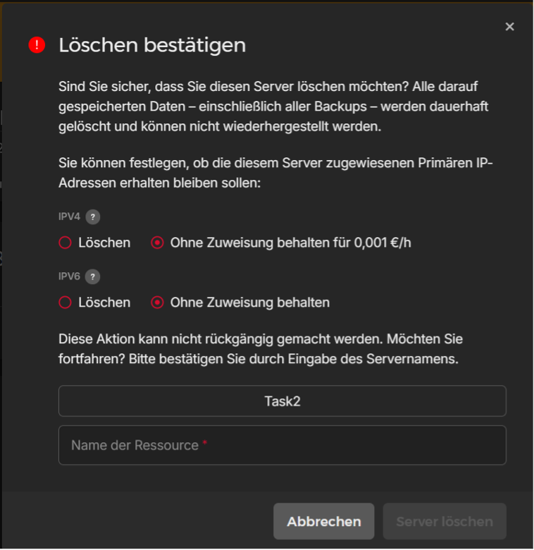
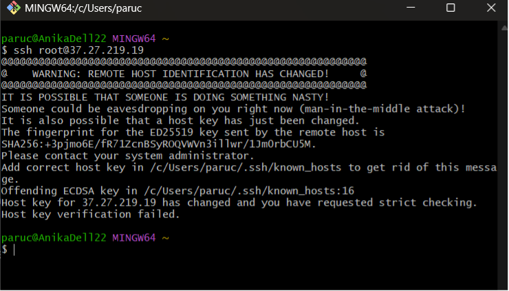
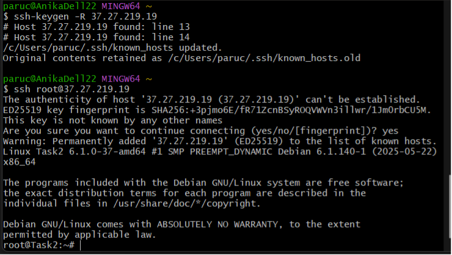

# Excersise 2: Server Re-Creation




## Why does this happen?

- When you first connected to your old server, **SSH saved the host key** (a kind of fingerprint) in the `~/.ssh/known_hosts` file.
- After creating a completely new server, it now has a different host key.
- Since the IP address is the same but the key changed, SSH shows a warning:
  “WARNING: REMOTE HOST IDENTIFICATION HAS CHANGED!”
- This is a security feature that protects you from a man-in-the-middle attack.

## How to solve this issue


You need to remove the old key associated with the IP from your local known_hosts file.

1. Run the following command (replace the IP with your server’s):

```tf
ssh-keygen -R 37.27.219.19
```

2. Try connecting to the server again via SSH:

```tf
ssh root@37.27.219.19
```

3. You’ll be asked to confirm the new key:

- Type yes and press Enter.
- The new key will automatically be saved in your `known_hosts`.
