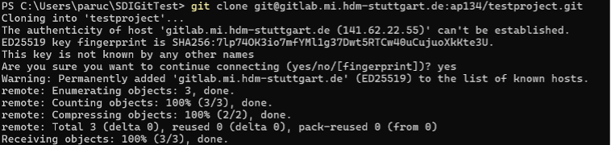
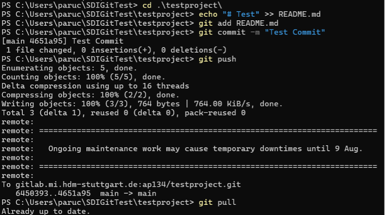

# Excersise 5: MI Gitlab access by ssh

## Step 1: Add SSH Key to GitLab

Go to your User Settings and open the SSH Keys tab.
Add your public key there.
You can test if the SSH key works by running:

```tf
ssh -T git@gitlab.mi.hdm-stuttgart.de
```

You should see the message:

```tf
Welcome to GitLab, <user>!
```


## Step 2: Create and Clone a Test Project

Create an empty test project in GitLab.
Copy the SSH clone link from the Clone option.
You can then clone the project with:

```tf
git clone git@gitlab.mi.hdm-stuttgart.de:<user>/<projectName>.git
```



## Step 3: Test Git Functions

Now you can make simple changes, e.g., edit the `README.md`.
Add the changes using `git add`, commit them, and then test push and pull.

