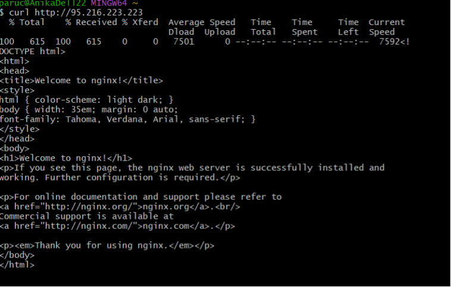
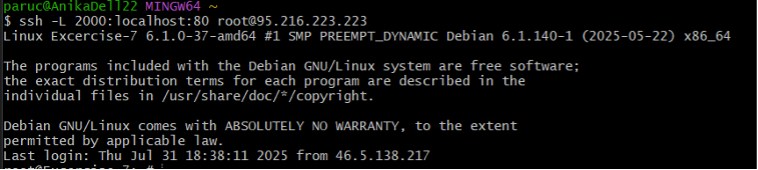
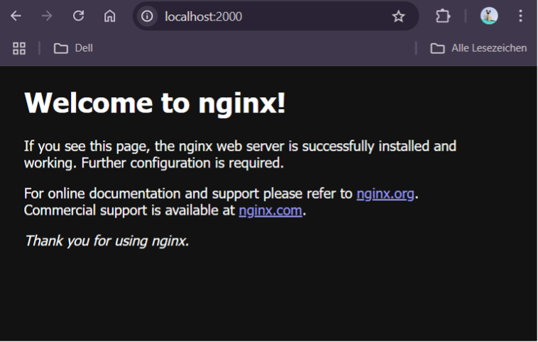
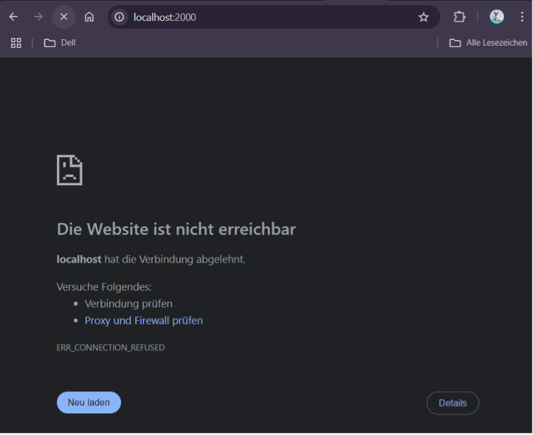

# Excersise 7: SSH Port Forwarding

new server is created with a firewall that has two rules:

- Port 22 with TCP
- ICMP protocol
  This means Port 80 is restricted by default.

## Step 1: Prepare the Server

Log into the server via bash and run the following commands to install and start Nginx:

```tf
apt update
apt install nginx
systemctl start nginx
```

## Step 2: Check if Nginx is Reachable from Outside

On your local machine (not inside the server), run:

```tf
curl http://<server-ip>
```

You should receive the Nginx default HTML page.



## Step 3: Set Up SSH Port Forwarding

Forward Port 80 on the server to your local Port 2000 via SSH:

```tf
ssh -L 2000:localhost:80 root@<server-ip>
```



## Step 4: Test in the Browser

While the SSH connection is active, open your browser and go to:

```tf
http://localhost:2000
```

You should see the same Nginx welcome page.


Once the SSH connection is closed, Nginx will no longer be accessible through the forwarded port.

