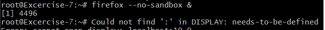
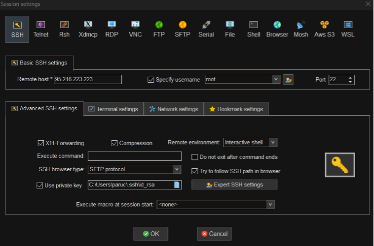
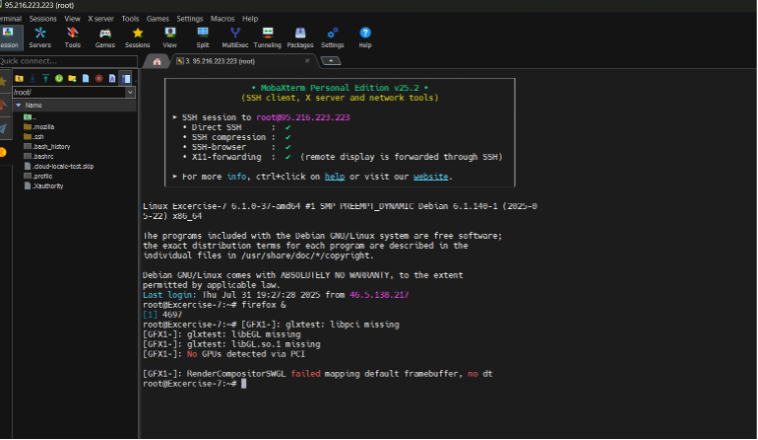
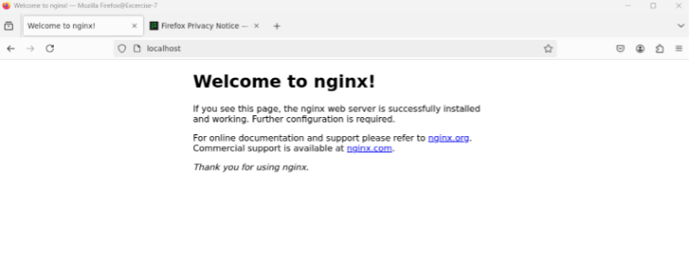

# Excersise 8: SSH X11 Forwarding

## Step 1: Setup

For this task, we use the same server as in No. 7, since the settings remain the same.

## Step 2: X11 Client for Windows

At first, we tried with **XLaunch**. The connection worked, but when attempting to open Firefox, the following error appeared.


After searching online, I found that there are known issues with the combination of Bash, Windows, and XLaunch.
So instead, I tried with another program: **MobaXterm**.

- Click on New Session
- Enter the server’s IP in Remote Host
- Check Specify username and enter root
- Ensure X11 Forwarding is selected (it already was by default)
- Activate Use private key and select your key file
  

## Step 3: Start Firefox

After clicking OK, the server connects directly.
Then simply run:

```tf
firefox &
```

to start Firefox.


## Step 4: Open http://localhost

In the Firefox browser, open:

```tf
http://localhost
```

You should see the **“Welcome to nginx!”** page again.

