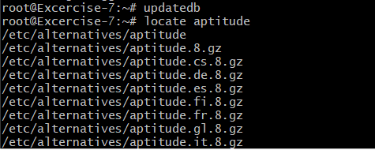
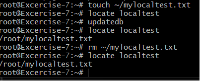

# Excersise 9: Enabling index based file search

## Step 1: Setup

We continue using the server from Task 7.
Install plocate with:

```tf
apt install plocate
```

## Step 2: Create an Index of the Current Filesystem Structure

In order to find files, you first need to run:

```tf
updatedb
```

This records the filesystem structure.
As a test, search for “aptitude” with:

```tf
locate aptitude
```



## Step 3: Test with a New File

Create a new file and search for it immediately.
Since `updatedb` was not executed beforehand, the file cannot be found.
After running `updatedb`, the file localtest is found.

If you delete the file and search for it again without running `updatedb`, it will still appear in the results, because the filesystem index was not updated.

